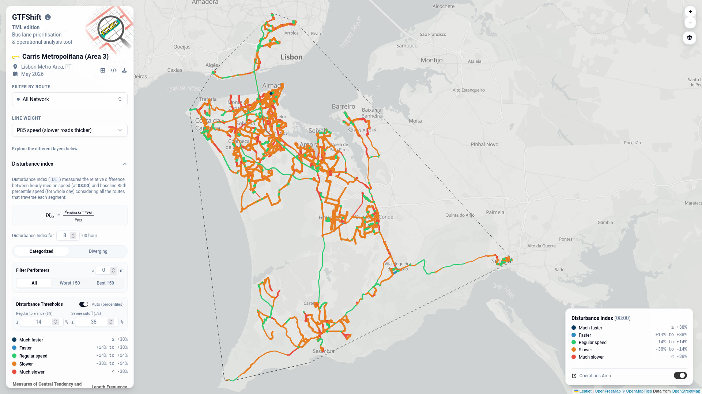

# Introdução {#sec-dashboard}

Os resultados da aplicação do GTFShift à rede de autocarros da Carris Metropolitana encontram-se disponíveis de forma interativa no painel [**GTFShift/TML**](https://ushift.pt/apps/gtfshift-tml){target="_blank"}.

{#fig-dashboard}

Este painel permite visualizar todas as análises realizadas em cada uma das dimensões documentadas neste relatório, para cada uma das quatro áreas de operação da Carris Metropolitana, permitindo uma análise espacializada detalhada e sem a necessidade de conhecimentos de programação ou manipulação de dados.

## Experiência de utilização

O painel interativo dispõe de três grandes vertentes de análise, que são documentadas nos próximos capítulos: 

- Ao nível da infraestrutura viária (@sec-dashboard-infra);
- Ao nível da linha de transporte público (@sec-dashboard-line);
- Ao nível da viagem de transporte público (@sec-dashboard-trip).

Antes de mergulhar nas diferentes análises, importa referir que o painel interativo dispõe de duas janelas de contexto global acessíveis através dos ícones superiores da barra lateral:

### Detalhes técnicos {#sec-modal-details}

Acessível através do segundo ícone, **Details**, esta janela apresenta metadados técnicos sobre a execução da análise para o conjunto de dados carregado:

- **Região** e **data do serviço GTFS** considerados;
- **Shapes e frequências consideradas** — número de geometrias encontradas no OSM relativamente ao total disponível no GTFS, com indicação das geometrias e linhas em falta (acessível via *tooltip*), e a distribuição horária da cobertura;
- **OSM query** utilizada para extrair a rede viária e as relações de transporte público do OSM;
- **Intervalo dos dados GTFS-RT**;
- **Metodologia de cálculo de velocidade** — descrição do método utilizado, com os limiares de filtragem utilizados;
- **Notas sobre dados RT e procura**;
- **Ambiente de execução** — versão do GTFShift, R e sistema operativo;
- **Código R simplificado** que reproduz a análise simplificada, com ligação ao tutorial completo.

### Download de dados {#sec-modal-download}

Acessível através do ícone último ícone, **Download**, esta janela permite descarregar os resultados em bruto para a região selecionada. Inclui:

- **Botão de download** do arquivo ZIP com todos os ficheiros processados para a região/área selecionada;
- **Tabela de estrutura do dataset** com a descrição de cada ficheiro incluído no arquivo;
- **Diagrama relacional** (entidade-relacionamento) que ilustra os esquemas dos ficheiros JSON/GeoJSON e as suas relações.