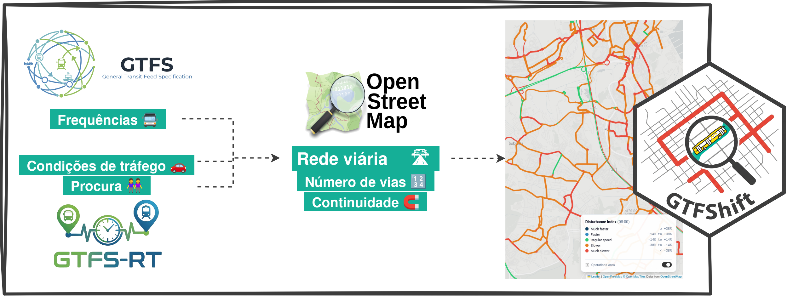

# Introdução {#sec-metodologia}

A metodologia, ilustrada na @fig-methodology, é implementada pelo ficheiro [`prioritise.R`](https://github.com/U-Shift/GTFShift-TML/blob/main/scripts/02_prioritise/prioritise.R){target="_blank"}, que orquestra todas as etapas de processamento de dados e geração dos resultados para o painel interativo. Este processamento é por sua vez parametrizado no ficheiro [`prioritise_parameters.R`](https://github.com/U-Shift/GTFShift-TML/blob/main/scripts/02_prioritise/prioritise_parameters.R){target="_blank"}, que define as configurações específicas para as áreas da Carris Metropolitana.

{#fig-methodology}

É importante ressalvar que o processamento aqui descrito implica a recolha e preparação antecipada de alguns dados, nomeadamente a recolha de dados GTFS-RT e a harmonização entre as geometrias do GTFS e OSM, com atualização dos identificadores correspondentes no último. Todos os detalhes destes procedimentos estão descritos no @sec-preparacao.

O fluxo de processamento segue então a seguinte sequência lógica:

```{mermaid}
%%| label: fig-pipeline-flow
%%| fig-cap: "Fluxo de processamento e execução da metodologia no script prioritise.R"
flowchart TD
    A["1. Carregamento do GTFS<br/>Filtragem por data e manipulação customizada"] --> B["2. Consulta e extração de dados OSM<br/>(via ficheiro .pbf local)"]
    B --> C["3. Associação GTFS–OSM<br/><code>GTFShift:<br/>:prioritise_lanes()</code>"]
    
    C --> D{"Dados adicionais<br/>disponíveis?"}
    
    D -- "Se GTFS-RT disponível" --> E["4a. Extensão dos segmentos<br/>com velocidades em tempo real<br/><code>GTFShift::rt_extend_<br/>prioritisation()</code>"]
    E --> F["4b. Perfis de velocidade e<br/>índice de perturbação por viagem<br/><code>GTFShift:<br/>:get_trip_speed_profile()</code>"]
    
    D -- "Se procura disponível" --> H["4c. Integração de dados de procura"]
    D -- "Apenas estático" --> G
    
    F --> G["5. Construção e exportação de ficheiros para o painel interativo<br/>(ways GeoJSON, way_data JSON, shape_data JSON, route_data JSON, metadata JSON)"]
    H --> G
```

O fluxo é executado para cada região definida, produzindo um conjunto de ficheiros de saída organizados por região e data de análise. 

Em seguida, descrevem-se as diferentes camadas de análise disponíveis no painel interativo, correspondendo a várias dimensões da rede de transporte público e da infraestrutura viária. Para cada uma, apresentam-se a sua metodologia de cálculo e documentação sobre a sua visualização e interpretação.

